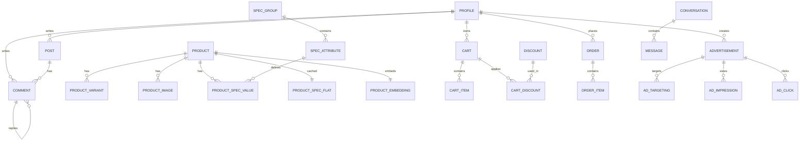

# E-commerce + AI Messaging Data Model

## Overview
This document defines the data model for an e-commerce system integrated with AI (LLM-based product Q&A). The schema is modularized into subdomains and designed for scalability, flexibility, and query performance.

---

# 1. ecom_message (AI Conversation)

## conversation
- id: UUID (PK)
- user_id: UUID (nullable)
- session_id: string (nullable)
- created_at: datetime (indexed)

## message
- id: UUID (PK)
- conversation_id: UUID (FK → conversation.id)
- role: string (USER, AI, SYSTEM)
- content: text
- message_type: string
- status: string
- metadata: JSONB (nullable)
- created_at: datetime (indexed)

---

# 2. ecom_user

## profile
- id: UUID (PK)
- full_name: string
- email: string (unique)
- role: string (ADMIN, CLIENT)
- created_at: datetime

---

# 3. ecom_product

## product
- id: UUID (PK)
- name: string
- description: text
- base_price: decimal
- brand: string
- category: string
- status: string
- llm_spec_text: text
- created_at: datetime (indexed)

## product_variant
- id: UUID (PK)
- product_id: UUID (FK → product.id)
- sku: string (unique)
- price: decimal
- stock_quantity: integer
- attributes: JSONB

## product_image
- id: UUID (PK)
- product_id: UUID (FK → product.id)
- image_url: string
- is_primary: boolean

---

# 4. ecom_product_spec

## spec_group
- id: UUID (PK)
- name: string
- category: string (nullable)
- sort_order: integer

## spec_attribute
- id: UUID (PK)
- group_id: UUID (FK → spec_group.id)
- name: string
- data_type: string (STRING, NUMBER, BOOLEAN, LIST, JSON)
- unit: string (nullable)
- sort_order: integer

## product_spec_value
- id: UUID (PK)
- product_id: UUID (FK → product.id)
- attribute_id: UUID (FK → spec_attribute.id)
- value_text: text (nullable)
- value_number: decimal (nullable)
- value_boolean: boolean (nullable)
- value_json: JSONB (nullable)

## product_spec_flat (optional)
- product_id: UUID (PK, FK → product.id)
- specs_json: JSONB

---

# 5. ecom_cart

## cart
- id: UUID (PK)
- user_id: UUID (FK → profile.id)
- status: string
- total_amount: decimal
- total_discount: decimal
- final_amount: decimal
- created_at: datetime

## cart_item
- id: UUID (PK)
- cart_id: UUID (FK → cart.id)
- product_variant_id: UUID (FK → product_variant.id)
- quantity: integer
- unit_price: decimal
- discount_amount: decimal
- final_price: decimal

## discount
- id: UUID (PK)
- code: string (unique)
- type: string
- value: decimal
- max_discount: decimal (nullable)
- min_order_value: decimal (nullable)
- start_date: datetime
- end_date: datetime

## cart_discount
- id: UUID (PK)
- cart_id: UUID (FK → cart.id)
- discount_id: UUID (FK → discount.id)
- applied_value: decimal

---

# 6. ecom_order

## order
- id: UUID (PK)
- user_id: UUID (FK → profile.id)
- status: string
- total_amount: decimal
- total_discount: decimal
- final_amount: decimal
- created_at: datetime (indexed)

## order_item
- id: UUID (PK)
- order_id: UUID (FK → order.id)
- product_variant_id: UUID (FK → product_variant.id)
- quantity: integer
- unit_price: decimal
- discount_amount: decimal
- final_price: decimal

---

# 7. ecom_content

## post
- id: UUID (PK)
- author_id: UUID (FK → profile.id)
- title: string
- content: text
- created_at: datetime (indexed)

## comment
- id: UUID (PK)
- post_id: UUID (FK → post.id)
- author_id: UUID (FK → profile.id)
- parent_id: UUID (self reference)
- content: text
- created_at: datetime (indexed)

## reaction
- id: UUID (PK)
- user_id: UUID (FK → profile.id)
- post_id: UUID (nullable)
- comment_id: UUID (nullable)
- type: string

---

# 8. ecom_ads

## advertisement
- id: UUID (PK)
- advertiser_id: UUID (FK → profile.id)
- title: string
- content: text
- budget: decimal
- status: string
- start_date: datetime
- end_date: datetime

## ad_targeting
- id: UUID (PK)
- advertisement_id: UUID (FK → advertisement.id)
- target_type: string
- target_value: string

## ad_impression
- id: UUID (PK)
- advertisement_id: UUID (FK → advertisement.id)
- user_id: UUID (nullable)
- viewed_at: datetime (indexed)

## ad_click
- id: UUID (PK)
- advertisement_id: UUID (FK → advertisement.id)
- user_id: UUID (nullable)
- clicked_at: datetime (indexed)

---

# 9. ecom_ai

## product_embedding
- product_id: UUID (PK, FK → product.id)
- embedding: vector
- updated_at: datetime

---

# ER Diagram (Simplified)

---

# Notes
- JSONB fields are used for flexibility (attributes, metadata)
- Spec system supports structured UI + filtering
- LLM integration via llm_spec_text + embedding
- Designed for async backend (SQLAlchemy-ready)
